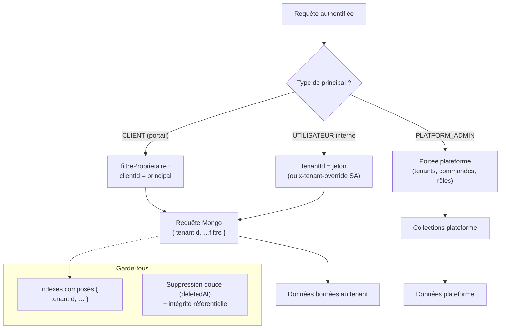

# 02 — Isolation multi-tenant

Chaque entité métier est rattachée à un `tenantId`. L'API ne retourne que les
données du tenant du principal (ou du tenant « chevauché » par un Super Admin
via l'en-tête `x-tenant-override`).

## Points clés
- **Le backend fait autorité** : le masquage frontend n'est jamais une garantie.
- Un document d'un autre tenant est introuvable : `findOne({ _id, tenantId })`
  → 404 (pas de 403 qui révélerait l'existence).
- Les clients (portail) ne voient que **leurs** demandes/changements/contrats
  (ownership) ; les VIEWER internes sont en lecture seule (`refuseViewer`
  sur les mutations).
- Le Super Admin n'appartient à aucun tenant et ne consomme pas de sièges.
