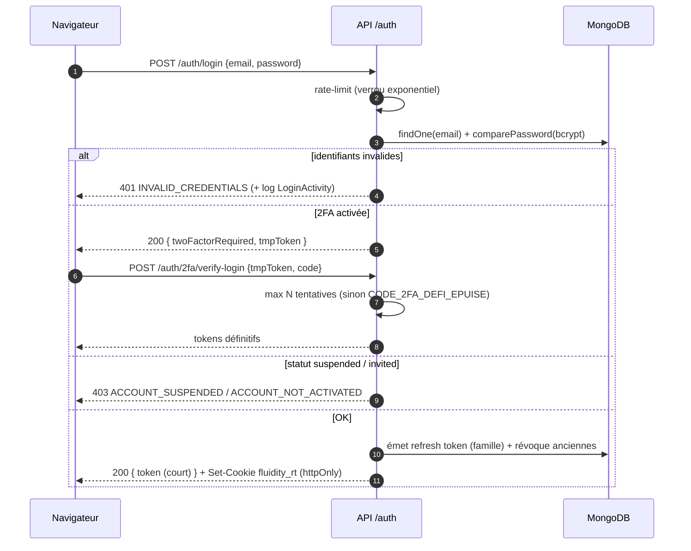

# 03 — Authentification (JWT + cookie refresh + 2FA)

Connexion : preuve du mot de passe (+ OTP si 2FA) contre un **access token
court** et un **cookie refresh httpOnly rotatif**. La vérification 2FA est
limitée en tentatives (verrou exponentiel).

## Points clés
- **Access token court** (minutes) → limite la fenêtre d'abus d'un jeton volé.
- Le rôle est **relu en base** à chaque autorisation (pas figé dans le jeton
  pour les décisions sensibles) — AUTH-002.
- `PLATFORM_ADMIN`/`TENANT_ADMIN` ne sont jamais accessibles par le portail
  client ; l'inscription publique est **supprimée** (AUTH-001).
- Chaque échec/succès est tracé (`LoginActivity`) avec raison d'échec.
