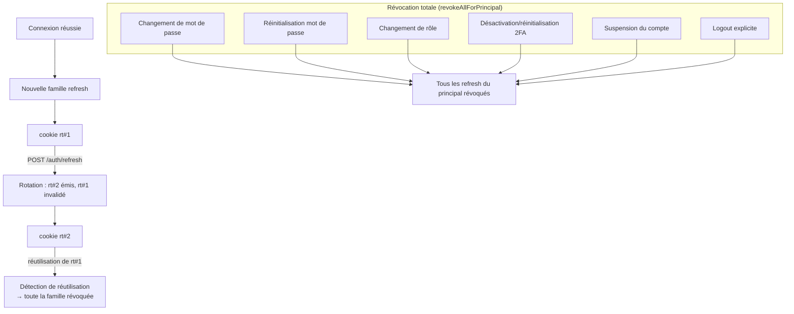

# 04 — Sessions : rotation du refresh + révocation

Le refresh token appartient à une **famille**. Toute rotation émet un nouveau
cookie et invalide l'ancien ; une **réutilisation** d'un ancien cookie révoque
toute la famille (détection de vol). Les événements sensibles révoquent toutes
les sessions du principal.

## Points clés
- Frontend : sur **401**, l'intercepteur tente UN refresh puis rejoue la
  requête ; échec → purge locale + `/login?expired=1` (FE-002 / UX-001).
- Un seul refresh en vol (partagé entre requêtes concurrentes) ; jamais de
  second rejeu (anti-boucle).
- La suspension d'un compte bloque immédiatement login **et** refresh.
