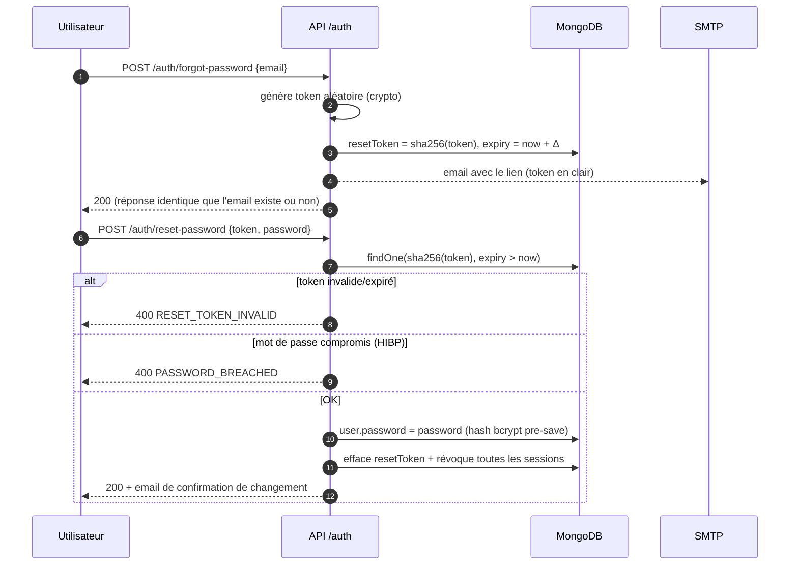

# 05 — Réinitialisation de mot de passe

Le lien contient un token **à usage unique** ; seul son **hash SHA-256** est
stocké, avec une expiration courte. L'usage du token le consomme immédiatement.

## Points clés
- Le clair du token n'est **jamais stocké** (seulement son empreinte) — CFG-002.
- La réponse « mot de passe envoyé » est identique que le compte existe ou
  non (pas d'énumération d'emails).
- Le nouveau mot de passe passe la **politique renforcée** (≥ 12, 4 classes,
  ≤ 72 octets) et la **vérification de fuites** — AUTH-005/008.
