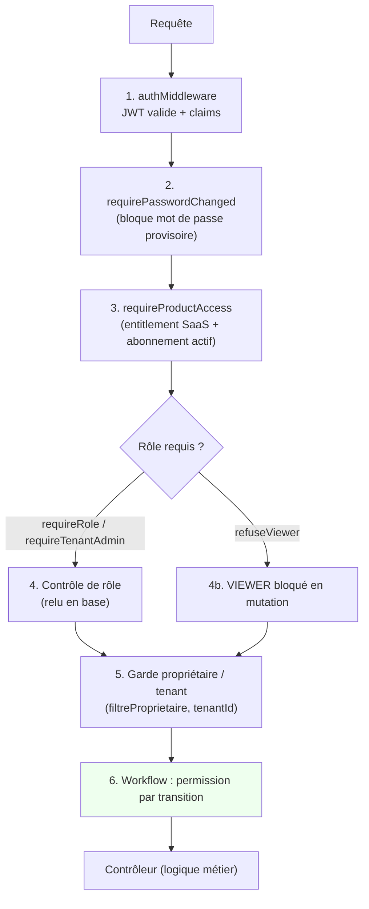

# 06 — Autorisation : couches successives

L'autorisation est appliquée en **plusieurs couches** (défense en profondeur).
Le backend fait toujours autorité ; le masquage frontend n'est qu'un confort.

## Points clés
- **Entitlement produit** (L3) : un rôle interne ne suffit pas ; il faut que le
  tenant ait le produit actif. Rôles par produit résolus via le registre.
- **Rang projet** (module Projet) : en plus de l'entitlement, un rang
  (admin/manager/membre/lecteur) par projet est vérifié.
- Les rôles sont résolus **dynamiquement** depuis la base (AUTH-002), pas
  seulement depuis le jeton.
- `PLATFORM_ADMIN` et `TENANT_ADMIN` peuvent forcer une transition de workflow
  (supervision), sauf depuis un état terminal.
