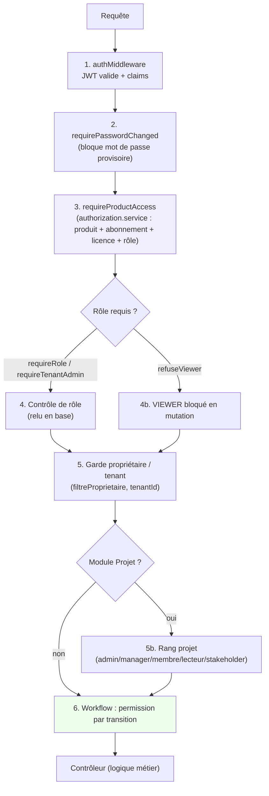

# 06 — Autorisation : couches successives

L'autorisation est appliquée en **plusieurs couches** (défense en profondeur).
Le backend fait toujours autorité ; le masquage frontend n'est qu'un confort.
Depuis A5, les vérifications partagent un **service d'autorisation centralisé**
(`backend/src/services/authorization.service.js`), agnostique du produit
(registre **et** produits plateforme en base).

## Points clés
- **Entitlement produit** (L3) : un rôle interne ne suffit pas ; il faut que le
  tenant ait le produit actif **et** que l'utilisateur soit licencié.
  Définition produit résolue via `resolveProductDefinition` (registre, sinon
  produit plateforme publié).
- **Rang projet** (module Projet) : en plus de l'entitlement, un rang
  (admin/manager/membre/lecteur/stakeholder) par projet est vérifié via le
  service centralisé (`resolveProjectRole` + `CAN.*`).
- Les rôles sont résolus **dynamiquement** depuis la base (AUTH-002), pas
  seulement depuis le jeton.
- `PLATFORM_ADMIN` et `TENANT_ADMIN` peuvent forcer une transition de workflow
  (supervision), sauf depuis un état terminal.
- **Refus explicites** : le frontend reçoit `product`/`reason`/`permission`
  (`no-license`, `not-subscribed`, `no-permission`) et affiche l'action
  corrective adaptée au rôle (page `/forbidden`).
