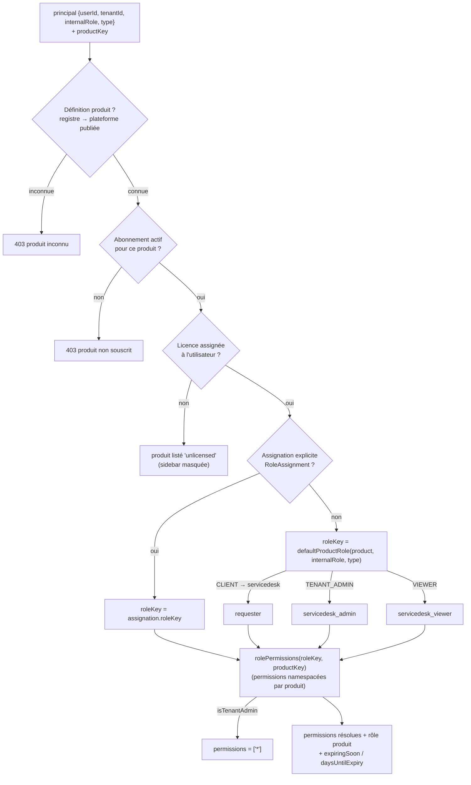

# 07 — Entitlements SaaS (résolution des droits produit)

Pour un produit donné, les permissions d'un principal dépendent de la
**définition produit** (registre ou produit plateforme publié), de son
**abonnement**, de sa **licence**, de son **rôle produit** (assignation
explicite ou rôle par défaut selon le rôle interne) et de son **type**
(CLIENT ↔ rôle `requester`).

## Points clés
- **CT-002** : les rôles génériques (`viewer`, `editor`) sont résolus **par
  produit** pour éviter qu'une table plate n'écrase les permissions d'un
  autre produit ; le lecteur ServiceDesk est déclaré (`servicedesk_viewer`).
- Le catalogue `/api/platform/roles/matrix` expose rôles + permissions par
  produit (registre **et** produits plateforme).
- Un admin de tenant reçoit `['*']` sur les produits souscrits.
- **Expiration** : `expiringSoon` + `daysUntilExpiry` remontent dans les
  entitlements ; à l'échéance, le job de cycle de vie notifie **tous les
  utilisateurs licenciés** (plus seulement les admins).
- Le frontend recalcule ses droits après chaque mutation
  (licence/rôle/approbation) via `refreshEntitlements()`.
