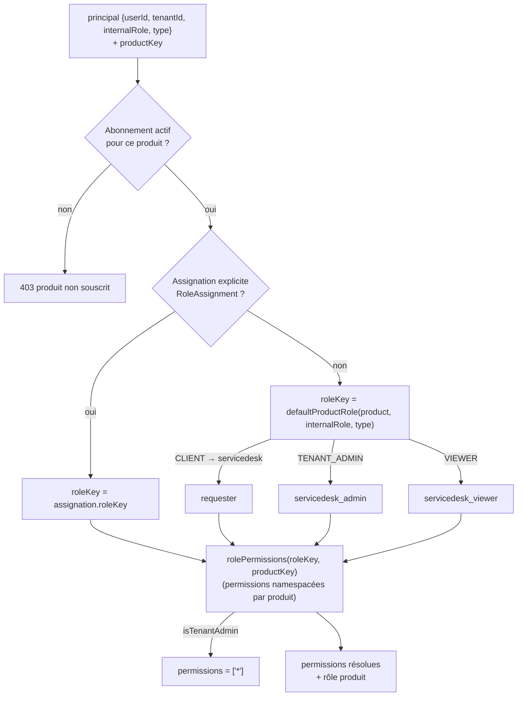

# 07 — Entitlements SaaS (résolution des droits produit)

Pour un produit donné, les permissions d'un principal dépendent de son
**abonnement**, de son **rôle produit** (assignation explicite ou rôle par
défaut selon le rôle interne) et de son **type** (CLIENT ↔ rôle `requester`).

## Points clés
- **CT-002** : les rôles génériques (`viewer`, `editor`) sont résolus **par
  produit** pour éviter qu'une table plate n'écrase les permissions d'un
  autre produit ; le lecteur ServiceDesk est déclaré (`servicedesk_viewer`).
- Le catalogue `/api/platform/roles` expose rôles + permissions par produit.
- Un admin de tenant reçoit `['*']` sur les produits souscrits.
