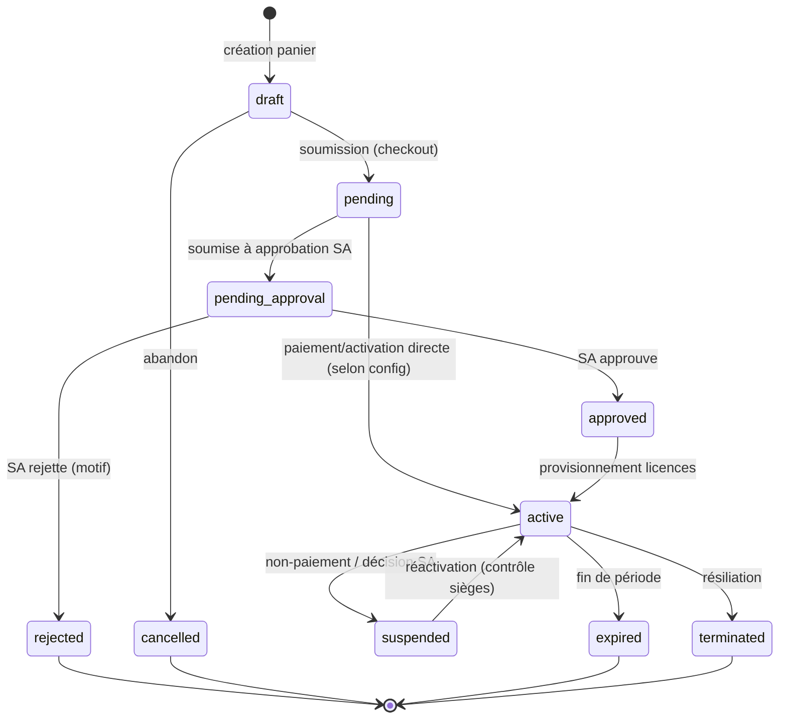
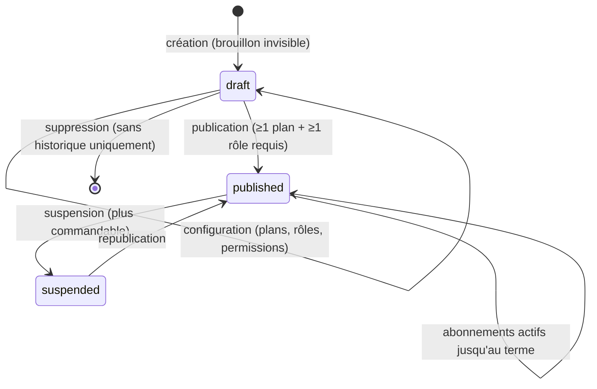

# 08 — Cycle de vie commande / abonnement / licence

Machine à états du parcours d'achat. L'approbation est **atomique et
anti-duplicate** : approuver deux fois la même commande ne crée pas deux
abonnements (garde `findOneAndUpdate` sur l'état attendu).

## Cycle de vie d'un produit plateforme (A5)

Les produits créés par le Super Admin suivent leur propre cycle avant de
rejoindre le catalogue :

## Points clés
- **Atomicité** : la transition d'approbation utilise une mise à jour conditionnelle
  (`status: 'pending_approval'` → `approved`) ; la seconde approbation est un no-op.
- Le **plafond de sièges** est contrôlé à la création d'utilisateur ET à la
  réactivation d'une licence (BIZ).
- Pas de fausse transaction de paiement : l'achat est **manuel**, approuvé par
  le Super Admin (exigence produit).
- **Publication** : un produit plateforme n'apparaît au catalogue que publié ;
  la suspension bloque les nouvelles commandes sans couper les abonnements en
  cours ; seul un brouillon sans historique peut être supprimé.
- **Échéance** : le job `saas-lifecycle` fait expirer les abonnements à terme
  et notifie chaque utilisateur licencié (lien `/workspace`) + les admins
  (lien `/abonnements`).
