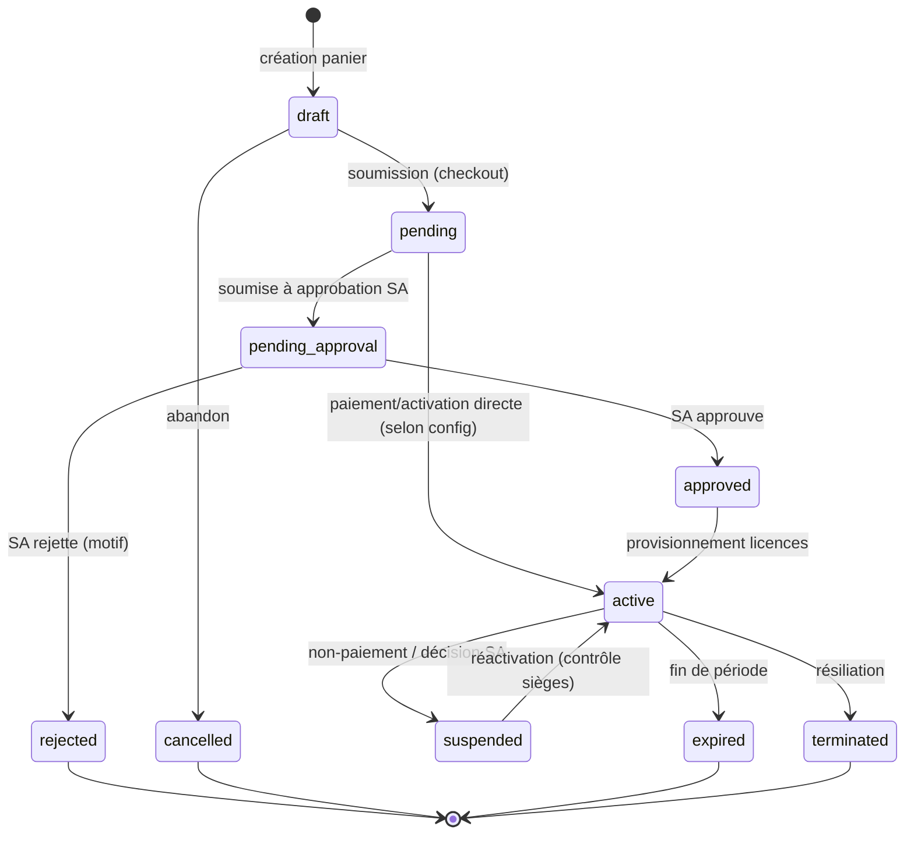

# 08 — Cycle de vie commande / abonnement / licence

Machine à états du parcours d'achat. L'approbation est **atomique et
anti-duplicate** : approuver deux fois la même commande ne crée pas deux
abonnements (garde `findOneAndUpdate` sur l'état attendu).

## Points clés
- **Atomicité** : la transition d'approbation utilise une mise à jour conditionnelle
  (`status: 'pending_approval'` → `approved`) ; la seconde approbation est un no-op.
- Le **plafond de sièges** est contrôlé à la création d'utilisateur ET à la
  réactivation d'une licence (BIZ).
- Pas de fausse transaction de paiement : l'achat est **manuel**, approuvé par
  le Super Admin (exigence produit).
