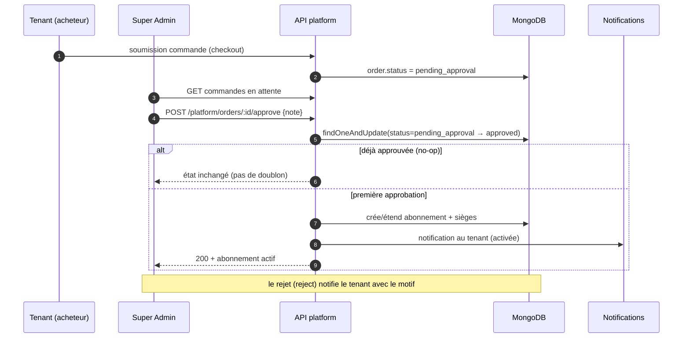

# 09 — Approbation Super Admin

Le Super Admin examine les commandes en attente depuis un écran dédié.
L'approbation provisionne l'abonnement et les licences, et notifie le tenant.

## Points clés
- **Anti double-approbation** : la transition est conditionnée à l'état
  `pending_approval` ; un second clic ne duplique rien (DB-003).
- Frontend : les boutons Approuver/Rejeter sont **verrouillés** pendant l'appel
  (UX-002, garde `actionEnCours`).
- Les rôles Super Admin et licences tenant sont **séparés** : le SA ne consomme
  pas de siège.
