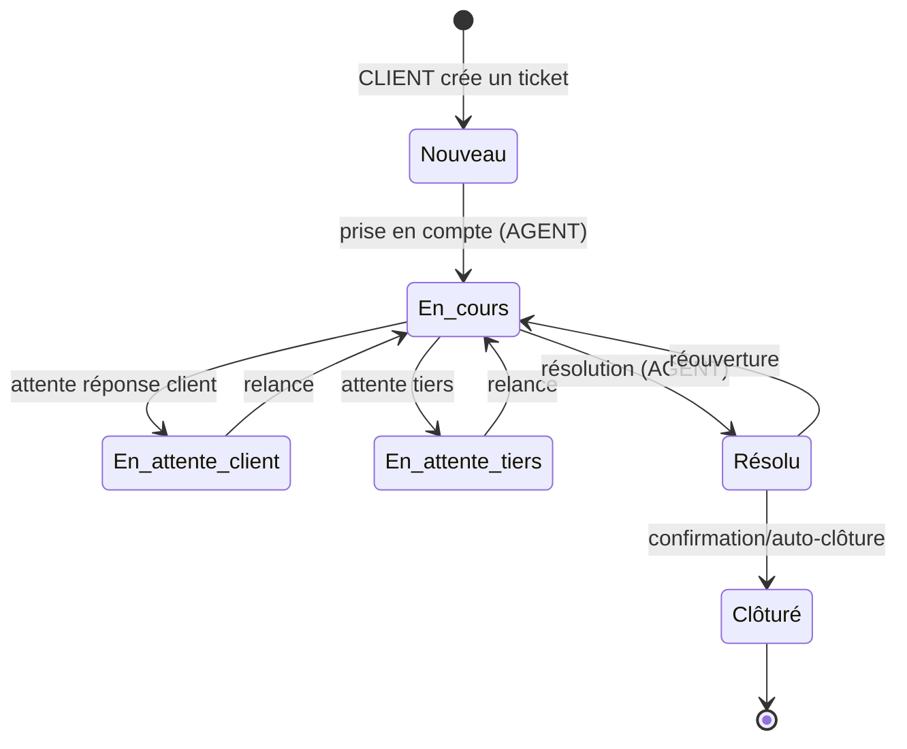

# 10 — Cycle de vie des tickets (ServiceDesk)

Les tickets sont créés par les **clients** (`requester`) et traités par les
agents. La priorité est **toujours dérivée** (matrice impact × urgence) ; les
transitions de statut suivent le workflow et mettent à jour le SLA.

## Points clés
- `priorite = calculatePriority(impact, urgence)` côté serveur ; le champ
  `priorite` envoyé par le client est ignoré (CT-003).
- **INFO-004** : une re-qualification qui change la priorité **réancre** les
  cibles SLA (`reancrerSla`).
- Un ticket `Clôturé` n'est plus modifiable (gel des états terminaux).
- Le SLA est suspendu dans les statuts d'attente (`TICKET_STATUTS_SLA_PAUSE`).
