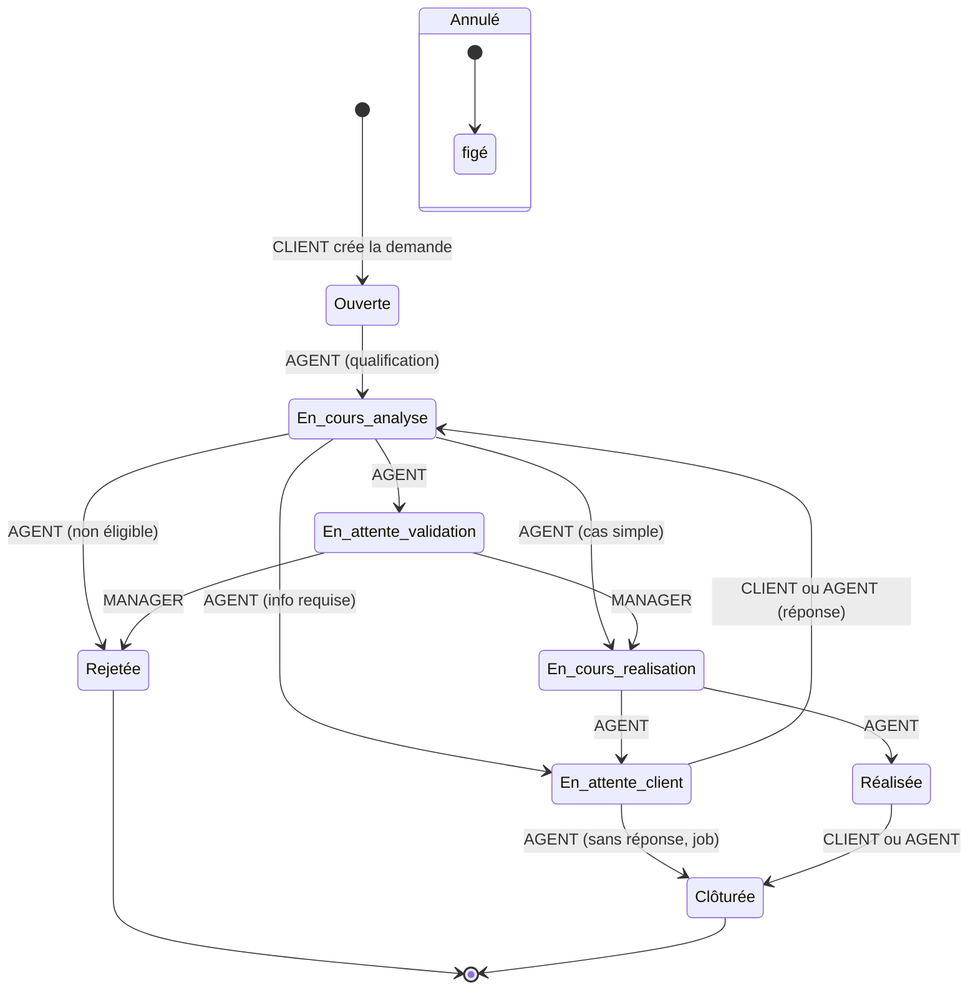

# 11 — Workflow des demandes

Chaque transition est bornée par **statut d'origine + rôles habilités**
(`DEMANDE_TRANSITIONS`). `TENANT_ADMIN`/`PLATFORM_ADMIN` peuvent forcer une
transition (supervision), **sauf depuis « Annulé »** (dossier figé).

## Points clés
- **Annulation** possible par le client propriétaire seulement depuis
  `Ouverte`, `En cours d'analyse`, `En attente de validation`,
  `En attente client` — jamais après le début de la réalisation ; l'enregistrement
  est conservé (historique/activités), pas de suppression silencieuse.
- États terminaux (`Rejetée`, `Clôturée`, `Annulé`) : plus aucune transition.
- Les transitions sont vérifiées **côté serveur** ; le frontend ne fait que
  proposer les actions disponibles.
