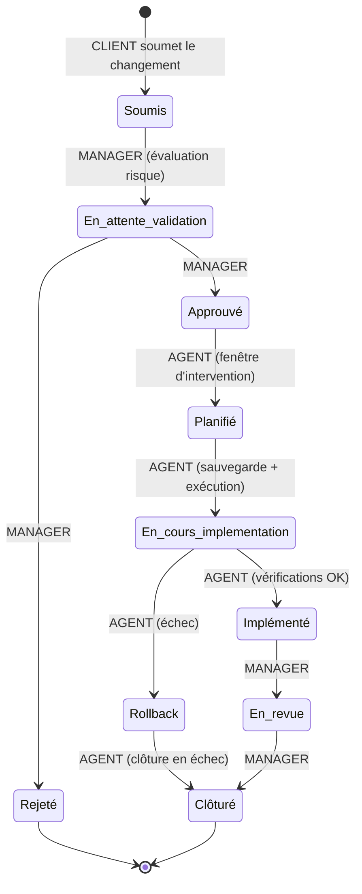

# 12 — Workflow des changements (ITIL)

Parcours complet d'un changement : évaluation, validation, planification,
implémentation avec possibilité de **rollback**, revue post-implémentation.

## Points clés
- Annulation par le client seulement avant l'implémentation : `Soumis`,
  `En attente de validation`, `Approuvé`, `Planifié`.
- Le **rollback** est une branche de premier ordre (pas un simple statut
  d'échec) : il mène à une clôture « échec » tracée.
- Chaque transition exige le rôle habilité ; forçage admin interdit depuis
  `Annulé`.
