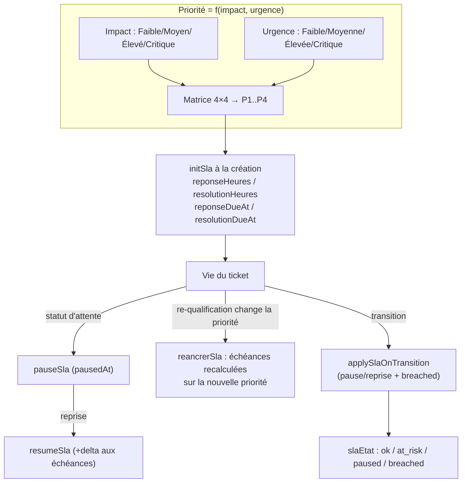

# 13 — Moteur SLA (priorité + échéances)

La priorité est une **fonction pure** de l'impact et de l'urgence (matrice).
Le SLA est ancré à la création, suspendu dans les statuts d'attente, et
**réancré** si la priorité change en cours de vie (INFO-004).

## Points clés
- **Matrice** : Faible/Faible → P4 ; Critique/Critique → P1 (cibles 1 h réponse /
  4 h résolution par défaut).
- La suspension (`En attente client/tiers`) décale les échéances du temps
  d'attente écoulé.
- Une re-qualification (PATCH impact/urgence) qui change la priorité réancre
  les cibles — vérifié par test runtime (INFO-004).
