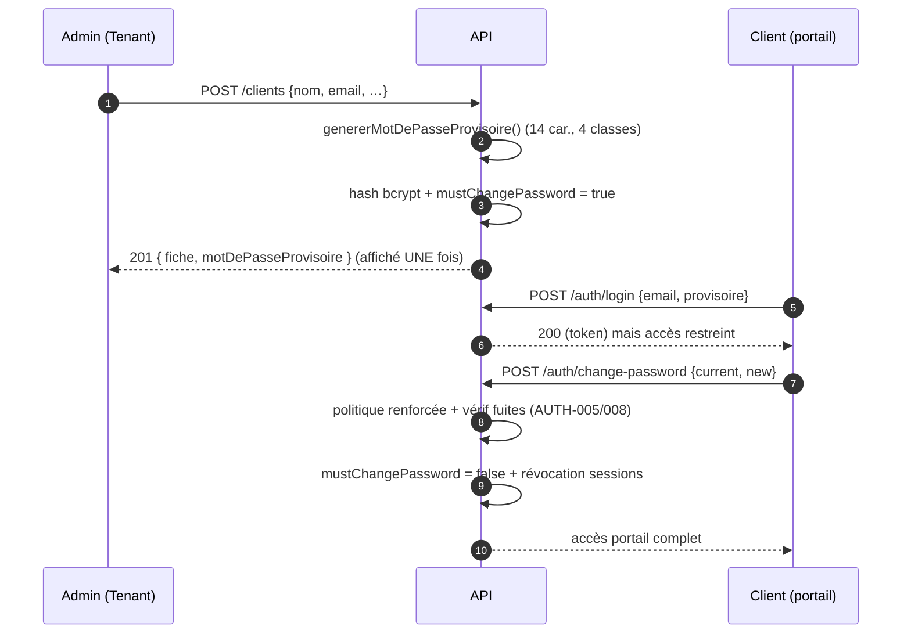

# 14 — Onboarding client (accès portail)

Un client est provisionné par un admin avec un **mot de passe provisoire**
(cryptographiquement sûr, affiché une seule fois). L'accès reste limité tant
que le mot de passe définitif n'est pas choisi.

## Points clés
- Le **gate `requirePasswordChanged`** bloque les routes métier tant que le
  provisoire n'est pas remplacé — la première action est de choisir un vrai
  mot de passe.
- Le provisoire n'est **jamais renvoyé** après la création ; le serveur n'en
  garde que le hash.
- Le mot de passe provisoire utilise un aléa `crypto.randomInt` (jamais
  `Math.random`) et des alphabets désambiguïsés (0/O, 1/l/I exclus).
