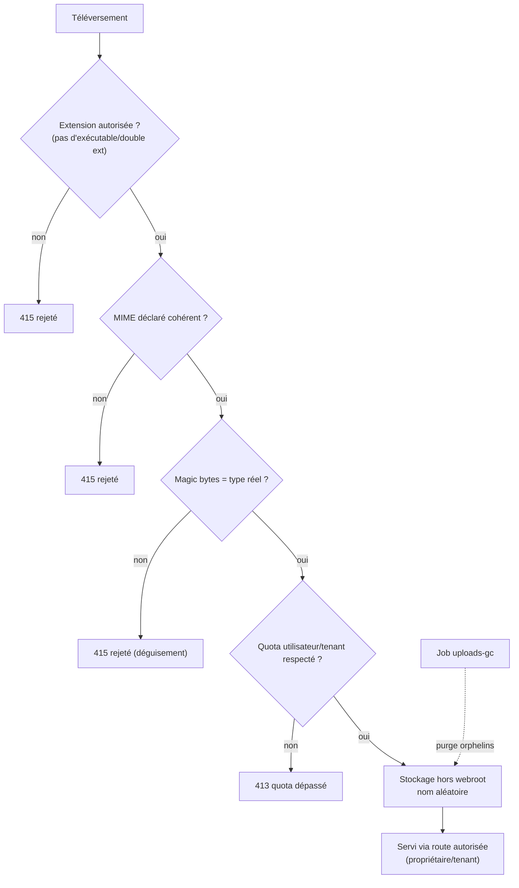

# 15 — Sécurité des fichiers uploadés

La validation est **défense en profondeur** : extension, MIME déclaré, puis
**signature magique** (magic bytes) — jamais la seule extension. Le service
est borné par quotas et servi derrière une autorisation.

## Points clés
- Un fichier `.jpg` contenant un exécutable est **rejeté** aux magic bytes
  (UPL-001).
- Les fichiers ne sont pas servis en statique brut : une route vérifie
  l'autorisation du demandeur (UPL-002).
- Quotas appliqués côté serveur (UPL-003) ; un job supprime les fichiers
  orphelins (verrouillé, idempotent).
