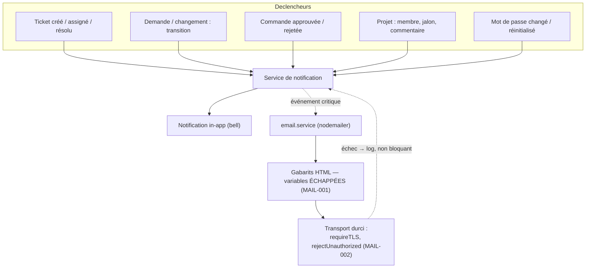

# 16 — Notifications

Les événements métier émettent des notifications in-app (cloche) et, pour les
événements critiques, des emails. L'envoi email est **asynchrone et non
bloquant** : un échec SMTP ne fait jamais échouer l'action métier.

## Points clés
- **Échappement HTML** systématique des valeurs injectées dans les gabarits
  (anti-injection dans les emails).
- Transport TLS durci + documentation SPF/DKIM/DMARC (`.env.example`).
- Les notifications de changement de mot de passe (MAIL-003) sont émises sur
  `changePassword` (client + utilisateur) et `resetPassword`.
