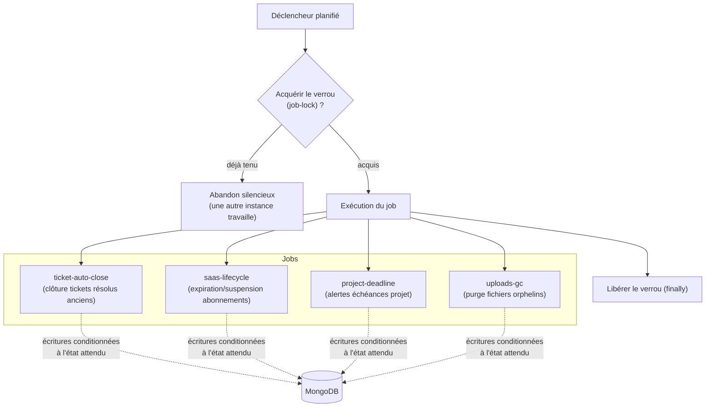

# 17 — Jobs planifiés (verrouillage + idempotence)

Chaque job s'exécute sous un **verrou** (un seul exécuteur à la fois, même sur
plusieurs instances) et est **idempotent** : rejouer le job ne produit pas
d'effet secondaire en double.

## Points clés
- **Verrou avec expiration** : si une instance meurt, le verrou finit par être
  ré-acquérable (pas de blocage définitif).
- **Idempotence** : les transitions d'état utilisent des conditions sur l'état
  courant (`findOneAndUpdate` avec filtre de statut) — rejouer est sans danger
  (JOB-001).
- Chaque job journalise son bilan (nombre d'éléments traités).
