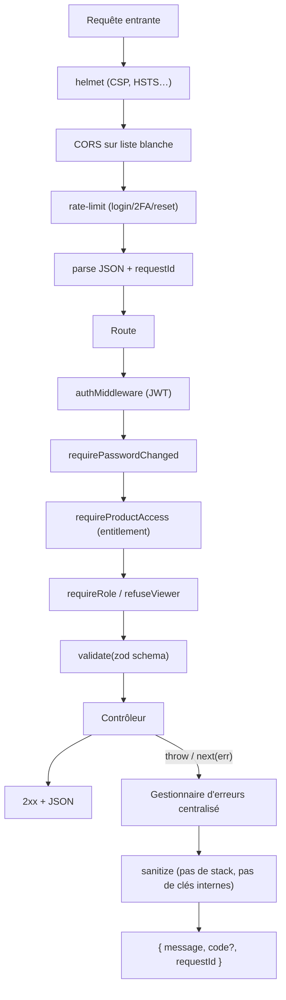

# 18 — Cycle de vie d'une requête API

Chaîne middleware d'Express, du bord à la réponse. Toute erreur passe par le
gestionnaire central (pas de fuite de stack), avec `requestId` corrélé.

## Points clés
- Les schémas **zod** bornent chaque entrée (liste blanche) ; les paramètres
  non reconnus sont retirés.
- `query parser: 'simple'` neutralise l'analyse imbattante de `qs`
  (mitigation CVE qs tout en restant sur Express 4).
- Chaque réponse porte `X-Request-Id` pour la corrélation logs/support.
