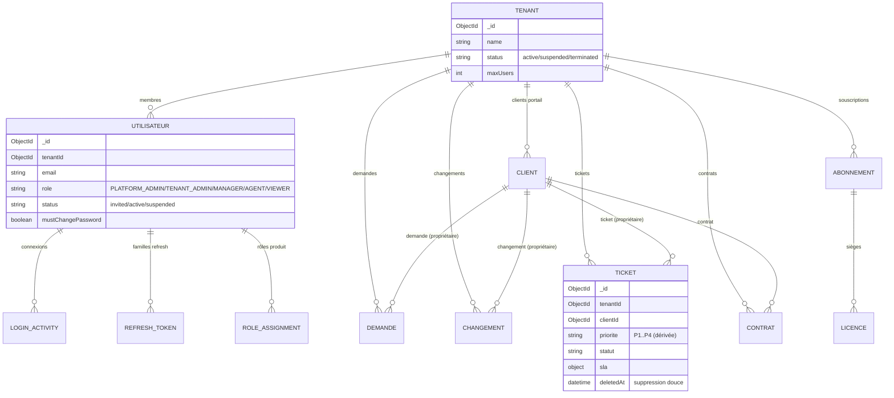

# 19 — Modèle de données (vue d'ensemble)

Toutes les collections métier portent `tenantId`. Les suppressions sont
**douces** (`deletedAt`) pour préserver l'intégrité référentielle et l'historique.

## Points clés
- Les rôles internes (`ROLES`) sont distincts des **rôles produit**
  (`RoleAssignment`), résolus par le registre.
- Les collections de sécurité (`RefreshToken`, `LoginActivity`) permettent la
  révocation de session et l'audit des connexions.
- `deletedAt` + index composés `{ tenantId, … }` : isolation et préservation de
  l'historique sans suppression destructive.
