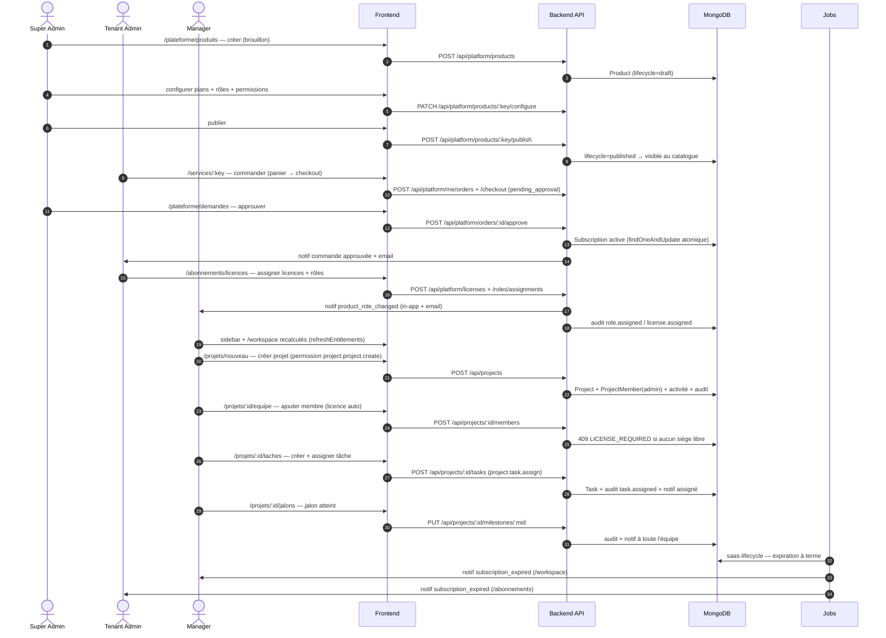

# 20 — Scénario SaaS de bout en bout (A5)

Parcours de référence validant toute la chaîne : administration produit,
achat, approbation, licences, rôles, puis usages projet. Chaque étape
indique la route UI, l'API appelée et les effets observables
(notifications in-app/email, journal d'activité, audit).

## Déroulé détaillé

| # | Acteur | Action UI | API | Effets attendus |
|---|--------|-----------|-----|-----------------|
| 1 | SA | `/plateforme/produits` → Nouveau produit | `POST /api/platform/products` | Brouillon invisible du catalogue |
| 2 | SA | Configurer plans (starter/business/enterprise), permissions, rôles | `PATCH …/products/:key/configure` | 400 si un rôle référence une permission inconnue |
| 3 | SA | Publier | `POST …/products/:key/publish` | 422 si aucun plan ou aucun rôle ; sinon visible dans `/services` |
| 4 | TA | Fiche `/services/:key` → commander (sièges, période) | `POST /api/platform/me/orders` + `/checkout` | Commande `pending_approval` |
| 5 | SA | `/plateforme/demandes` → approuver | `POST /api/platform/orders/:id/approve` | Souscription `active` ; 2ᵉ approbation = no-op ; notif TA |
| 6 | TA | `/abonnements/licences` → licences + rôles produit | `POST /api/platform/licenses`, `POST /api/platform/roles/assignments` | Notif `product_role_changed` à l'utilisateur ; audit |
| 7 | M | Connexion → sidebar + `/workspace` | `GET /api/platform/me/entitlements` (refresh auto) | Produit visible ; sans licence → `/forbidden?reason=no-license` |
| 8 | M | `/projets/nouveau` | `POST /api/projects` | 403 sans `project.project.create` ; créateur = admin + rapport équipe |
| 9 | M | `/projets/:id/equipe` → ajouter | `POST …/members` | Licence auto-provisionnée ; badge « Sans licence » sinon ; `409 LICENSE_REQUIRED` si saturé |
| 10 | M | `/projets/:id/taches` → créer + assigner | `POST …/tasks` (`project.task.assign`) | Assigné = membre du même tenant ; `warnings: [ASSIGNEE_WITHOUT_LICENSE]` si besoin ; notif assigné |
| 11 | M | Réaffecter / désassigner | `PUT …/tasks/:taskId` | Même garde ; activité `task_assigned` / `task_reassigned` avec nom de l'assigné |
| 12 | M | `/projets/:id/jalons` → terminé | `PUT …/milestones/:mid` | Audit + notif `milestone_completed` à toute l'équipe (sauf acteur) |
| 13 | — | Échéance abonnement (job) | `saas-lifecycle` | Produit → `unlicensed`/expiré ; notif à **tous les licenciés** + admins |
| 14 | SA | `/plateforme/audit` | `GET /api/platform/audit` | `role.*`, `license.*`, `task.*`, `project.milestone_completed` horodatés |

## Cas de refus à vérifier

- Utilisateur sans licence ouvrant `/projets` → `/forbidden?reason=no-license`
  (message 🎫 + action corrective selon le rôle).
- Tenant non abonné ouvrant `/apps/:key` → `reason=not-subscribed` (🛒).
- Membre sans permission cliquant une action gardée → `reason=no-permission`
  avec la permission manquante.
- Ajout d'un membre sans siège libre → `409 LICENSE_REQUIRED` (jamais
  d'ajout silencieux sans licence).
- Assigné hors tenant → `403 CROSS_TENANT_MEMBER` ; non-membre → `409`.
- Suppression d'un produit publié ou avec historique → `409` ; brouillon
  sans historique → supprimé.
