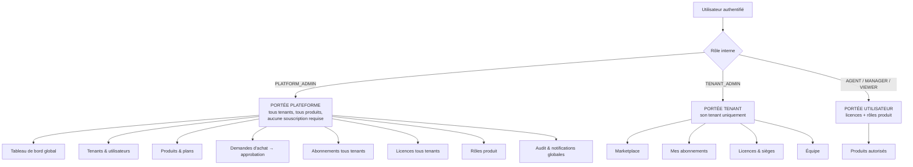
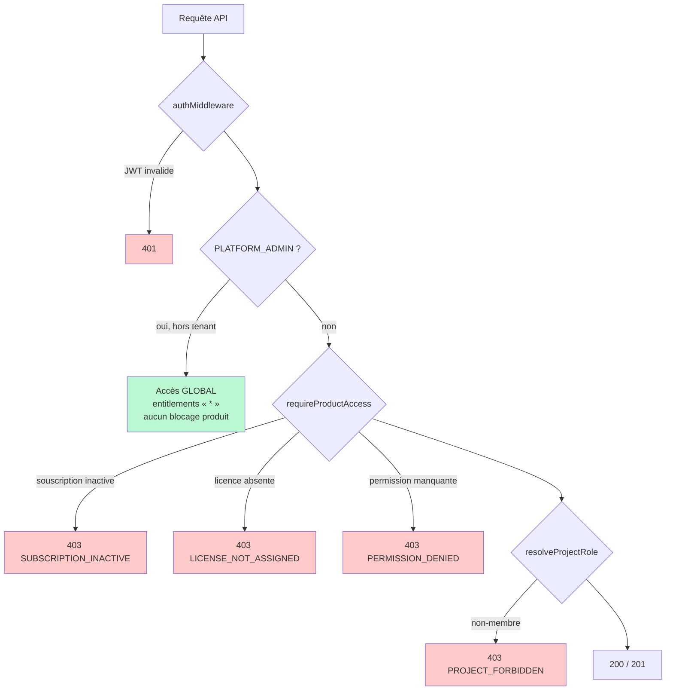
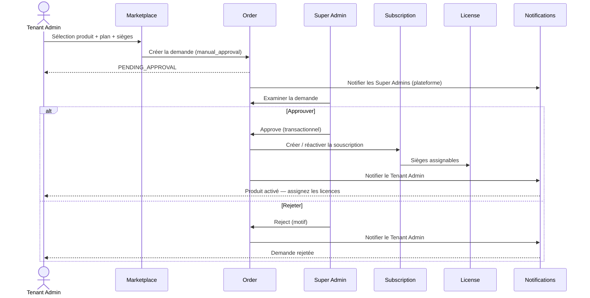
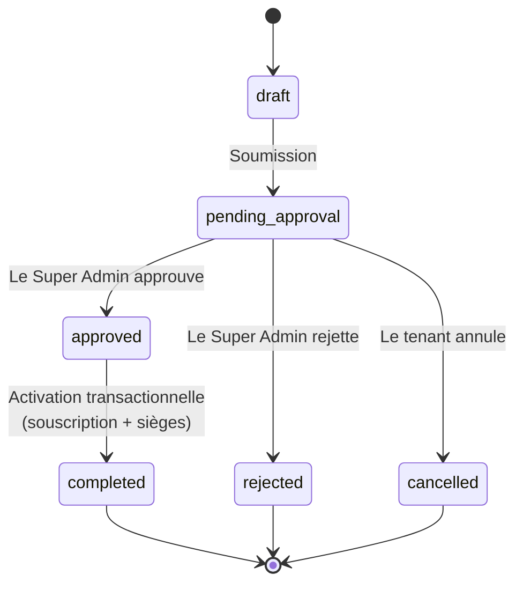
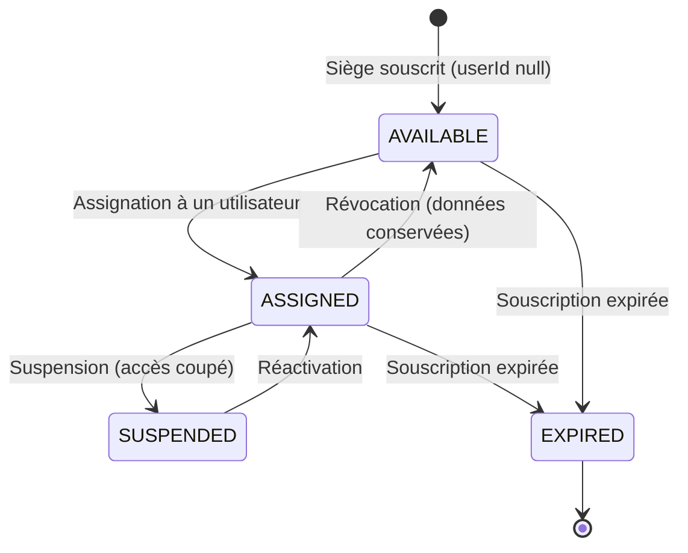
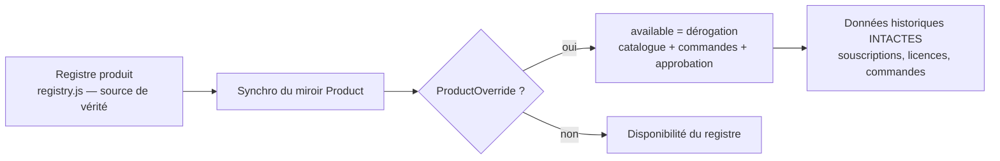

# Architecture de la plateforme — Super Admin, SaaS & approbation

Diagrammes [Mermaid](https://mermaid.js.org) de l'architecture plateforme :
scopes de sécurité (Super Admin ≠ utilisateur de tenant), cycle d'achat,
approbation transactionnelle, licences, isolation inter-tenant.

---

## 1. Scopes de sécurité — Super Admin vs Tenant Admin vs Utilisateur



## 2. Chaîne d'autorisation serveur (3 niveaux, jamais le frontend seul)



## 3. Cycle d'achat — de la demande à l'accès produit



## 4. Machine à états de la commande



## 5. Machine à états de la licence



## 6. Isolation inter-tenant

```mermaid
flowchart TD
    U[Utilisateur du tenant A] --> AUTH[Requête authentifiée]
    AUTH --> SCOPE[tenantId = A — figé côté serveur]
    SCOPE --> Q[Requêtes : { tenantId: A }]
    Q --> DATA[Données de A uniquement]
    X[Utilisateur du tenant B] -. tentatives cross-tenant .-> DENY[403 CROSS_TENANT_*]

    SA[Super Admin] --> G[Requêtes globales sans filtre tenant<br/>ou impersonation x-tenant-override]
    G --> ALL[Tous les tenants — inspection administrative]
```

## 7. Dérogation produit (réversible, sans perte de données)



## 8. Règle d'or

```text
SUPER ADMIN  ≠  UTILISATEUR DE TENANT

Super Admin      → gère la plateforme (tous tenants, tous produits)
Tenant Admin     → gère SON tenant (produits souscrits, licences, équipe)
Utilisateur      → travaille dans les produits pour lesquels il a une licence
Licence          → contrôle l'accès produit
Permission       → contrôle les actions
Souscription     → contrôle la propriété produit
Achat            → DEMANDE → APPROBATION Super Admin → SOUSCRIPTION ACTIVE
                  → LICENCES → ACCÈS PRODUIT
```
