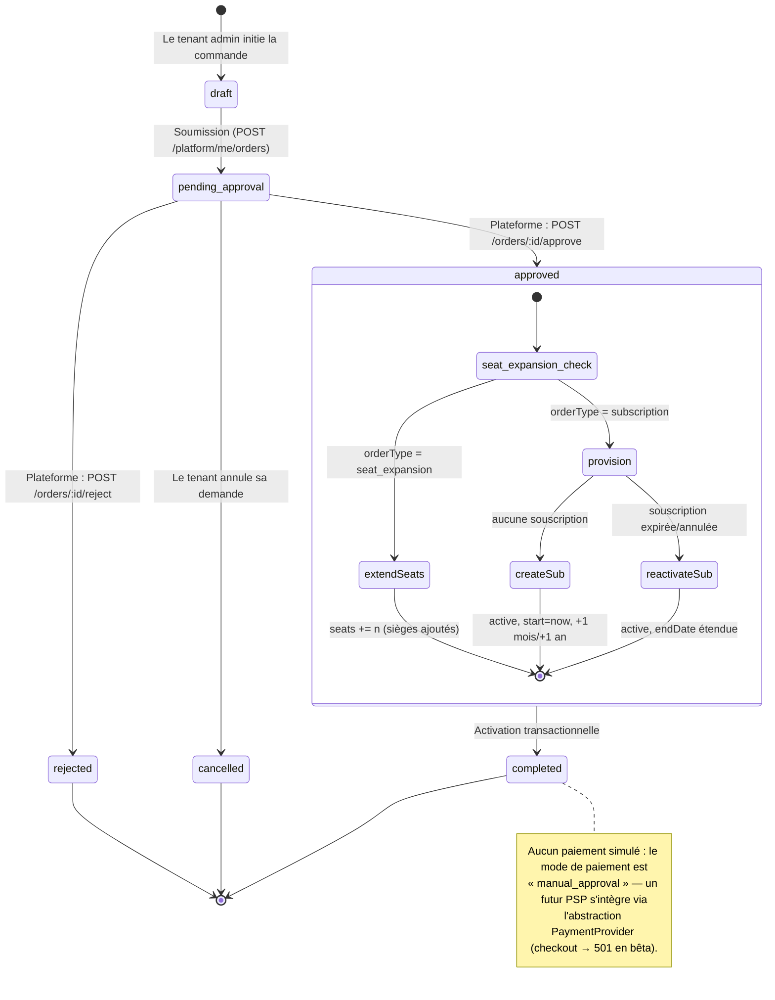
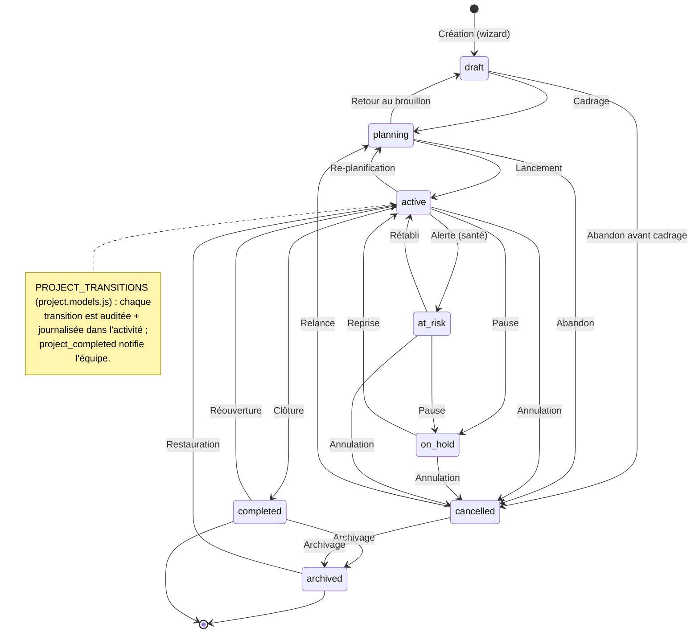
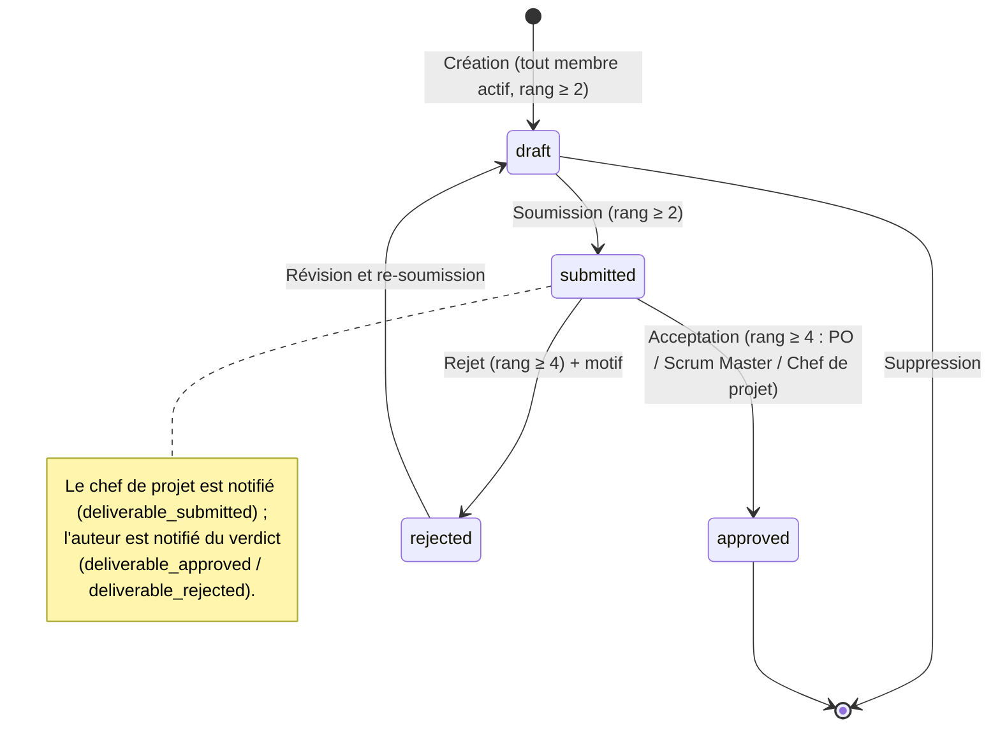
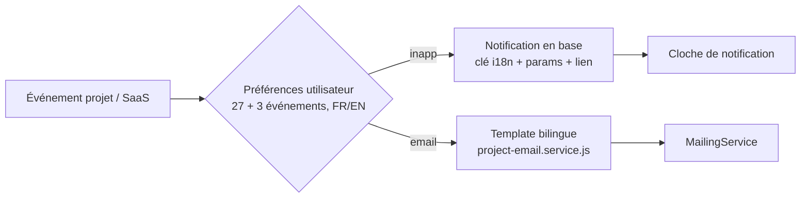
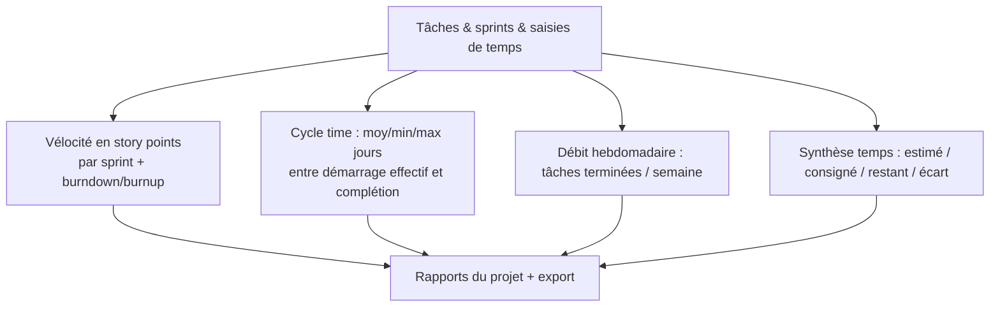

# Diagrammes d'architecture — Gestion de Projet & SaaS

Diagrams [Mermaid](https://mermaid.js.org) du produit **Gestion de Projet**
(`project_management`) et de son intégration au socle SaaS de Fluidity.
Rendus nativement par GitHub et les IDE compatibles Mermaid.

---

## 1. Cycle de vie d'une commande (achat → approbation → souscription)



---

## 2. Cycle de vie d'un projet (transitions validées serveur)



---

## 3. Cycle d'approbation d'un livrable



---

## 4. Chaîne d'autorisation serveur (3 niveaux)

```mermaid
flowchart TD
    A[Requête /api/projects/...] --> B{authMiddleware}
    B -- échec --> B1[401]
    B --> C{requireProductAccess}
    C -- tenant inconnu / cross-tenant --> C1[403 PRODUCT_NOT_ACCESSIBLE]
    C -- souscription inactive/expirée/suspendue --> C2[403 SUBSCRIPTION_INACTIVE]
    C -- licence absente/révoquée --> C3[403 LICENSE_REQUIRED]
    C -- permission produit manquante --> C4[403 PERMISSION_DENIED]
    C --> D{Contrôleur : resolveProjectRole}
    D -- non-membre, projet privé --> D1[403 PROJECT_FORBIDDEN]
    D --> E{can(role, action)}
    E -- rang insuffisant --> E1[403 / 400]
    E --> F[200 / 201]

    style A fill:#4f46e5,color:#fff
    style B1 fill:#fecaca
    style C1 fill:#fecaca
    style C2 fill:#fecaca
    style C3 fill:#fecaca
    style C4 fill:#fecaca
    style D1 fill:#fecaca
    style E1 fill:#fecaca
    style F fill:#bbf7d0
```

Rangs projet (`project-access.util.js`) :

| Rang | Rôles | Peut |
|---|---|---|
| 6 | `project_admin` (+ admins tenant/plateforme) | tout |
| 5 | `project_manager` | cycle de vie, membres, workflow, santé |
| 4 | `scrum_master`, `product_owner` | backlog, approbation des livrables |
| 3 | `project_lead` | créer/affecter/planifier les tâches |
| 2 | `developer`, `designer`, `qa` | mettre à jour, consigner du temps |
| 1 | `project_member` | commenter |
| 0 | `project_viewer` | consulter |

---

## 5. Flux de notification (in-app + e-mail, préférences par utilisateur)



Événements notifiables : assignation/échéance/retard de tâche, jalons,
sprints (démarrage, fin, fin imminente), projet terminé, livrables
(soumission/approbation/rejet), risques/problèmes assignés, souscriptions
(demande, approbation, rejet, expiration, renouvellement), licences
(assignation, retrait, limite atteinte).

---

## 6. Rapports & indicateurs (vélocité, cycle time, débit, temps)


